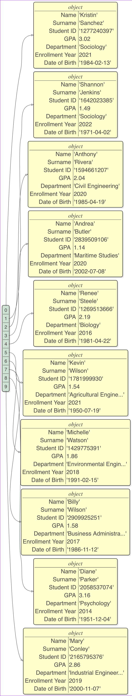

## NKÜ Bilgisayar Mühendisliği Veri Yapıları (BMB212) 2022-2023 Bahar Donemi Dersi Uygulama Not ve Duyuruları

Bu repo'da uygulama derslerine ait materyallere (ders notlari, odev bilgileri, proje bilgileri, duyurular vb.) ulasabilirsiniz.

### Iletisim

Ars. Gor. Güvenç Usanmaz

Oda: B207

Bolum: Bilgisayar Muhendisligi

Email: gusanmaz <att< nku nokta edu nokta tr

### Onerilen Kaynaklar

* [CS50](https://cs50.harvard.edu/college/2022/spring/)
* [Introduction to Programming in Java](https://introcs.cs.princeton.edu/java/home/)
* [Algorithms, 4th Edition by Robert Sedgewick and Kevin Wayne](https://algs4.cs.princeton.edu/home/)
* [Algoritmalar, Robert Sedgewick, NOBEL AKADEMİK YAYINCILIK](https://www.kitapyurdu.com/kitap/algoritmalar/498451.html)
* [Introduction to Algorithms, Fourth Edition](https://www.amazon.com/Introduction-Algorithms-fourth-Thomas-Cormen/dp/026204630X)
* [Coding Train](https://www.youtube.com/channel/UCvjgXvBlbQiydffZU7m1_aw)
* [2021-2022 Bahar Donemi BMB212 Ders Sayfasi](https://github.com/gusanmaz/BMB212_Algorithms)
* [Python Tutor](https://pythontutor.com/)


**Algorithm Visualisation - Algoritma Gorsellestirme**

* [https://visualgo.net/en](https://visualgo.net/en)
* [https://algorithm-visualizer.org/](https://algorithm-visualizer.org/)
* [https://www.cs.usfca.edu/~galles/visualization/Algorithms.html](https://www.cs.usfca.edu/~galles/visualization/Algorithms.html)

### Git


* [Pro Git book](https://git-scm.com/book/en/v2)
* [Turkce Git 101](https://aliozgur.gitbooks.io/git101/content/)
* [Git Basit Rehber](https://rogerdudler.github.io/git-guide/index.tr.html)
* [Yeni Baslayanlar icin Git 101](https://medium.com/@muratcanbur/yeni-ba%C5%9Flayanlar-i%C3%A7in-git-101-ff7ea5b3eff9)
* [Git Cheatsheet](https://education.github.com/git-cheat-sheet-education.pdf)
* [Git Github Kullanim Rehberi](https://www.enesonmez.com/git-github-nedir-kullanim-rehberi/)
* [Introduction to Git - talk by Scott Chacon](https://youtu.be/xbLVvrb2-fY)
* [Introduction to Git with Scott Chacon of GitHub](https://youtu.be/ZDR433b0HJY)
* [Git 101 | Git, GitHub nedir?](https://youtu.be/nyIdgGD74c4)
* [Git, GitHub ve GitLab Kullanımı Playlist](https://www.youtube.com/playlist?list=PLPrHLaayVkhnNstGIzQcxxnj6VYvsHBHy)

### Terminal Kullanimi

* [Linux Tutorial for Beginners - Learn Linux and the Bash Command Line](https://ryanstutorials.net/linuxtutorial/)
* Windows? [Cygwin](https://www.cygwin.com/)

### Debugging - Hata Ayiklama


* Break points
* Step into vs. Step over
* Step out
* Variable values
* [IntelliJ IDEA Debugging](https://www.jetbrains.com/help/idea/debugging-code.html)

### Command Line Arguments

* [Command Line Arguments](https://docs.oracle.com/javase/tutorial/essential/environment/cmdLineArgs.html)
* [Java Ornek Kodu - Github Gist](https://gist.github.com/gusanmaz/49dae8ffd1b1511e7c394a259dae785d)
* [Replit Ornek Kodu](https://replit.com/@GuvencUsanmaz/CommandLineArgsJavaExample1)


Komut satirindan alinan iki tam sayinin toplamini ekrana yazdiran kod:

```java
public class Main {
  public static void main(String args[]) {
    int num1 = Integer.parseInt(args[0]);
    int num2 = Integer.parseInt(args[1]);
    System.out.println(num1 + num2);
  }
}
```

Main.java isimli dosyada saklanabilecek yukarida verilen kodun derlenmesi icin calistirilmasi gereken terminal komutu:

```bash
javac Main.java
```

javac programinin derleme sonrasi olusturdugu calistirilabilir program Main.class'in calistirilmasi:

```bash
java Main 4 5 
```

Calistirilan programin ciktisi:

```bash
9
```

### Odev ve Projeler

**Verilen butun odev ve projelerde uyulmasi gereken kurallar**
* Kodlarinizi aksi belirtilmedikce Java dilinde yaziniz.
* Aksi belirtilmedikce kendinizin yazdigi kodlarda Java kutuphanelerinin siniflarini kullanmayiniz. Ornegin ArrayList, List, Math vb.
* Aksi belirtilmedikce reponuzda .Java ve .txt uzantili dosyalar haricinde uzantisi olan bir dosya bulunmamalidir.
* Her odev/proje icin Github Classroom davet linki ile olusturulan repo'ya kodlarinizi yuklemeniz (commit - push) gerekmektedir.
* Olusturulan repodaki kok dizine (en ust dizine) `{ogrenci_no}.txt` isimli bos bir dosya eklemeniz gerekmektedir.
  Ornegin ogrenci numaraniz 1234567890 ise kok dizine `1234567890.txt` isimli bos bir dosya eklemeniz gerekmektedir.
* Verilen odev ve projelerin Github'a ilgili odev/projenin son gonderim tarihinden once gonderilmesi gerekmektedir.
* Odev ve projelerde bireysel calisilmasi beklenmektedir.
* Verilen odev ve projelerdeki ana amac algoritma tasarimi ve kod yazma becerilerinin gelistirilmesidir.
  Bu nedenle odev ve projeleri derste ogrendiginiz bilgiler isiginda mumkun oldugunca kendi cabalarinizla yapmaniz beklenmektedir.
* Verilen odev ve projelerin cozumu icin ChatGPT, Copilot gibi araclari kullanmaktan kacininiz. 
  Bu araclari dogrudan odev sorularini kodlamak icin kullanmaniz durumunda bu araclardan neden ve ne sekilde yardim
  aldiginizi projenizin kok dizinine ({ogrenci_no}.text) ekleyeceginiz `llm.txt` dosyasinda ayrintili bir sekilde aciklayiniz.
  Internetten kopyala-yapistir yaptiginiz kodlar icin de bu dosyaya ayrintili bir aciklama eklemeniz gerekmektedir.
* Projeleriniz otomatik kod degerlendirme programi tarafindan degerlendirebilir. Bu nedenle reponuzdaki projelerin
  hatasiz derlenebilir oldugundan ve sizden istenildigi gibi calistigindan emin olunuz. **Derlenmeyen odevler, {ogrenci_no}.txt
  dosyasi eksik odev ve projeler 0 alacaktir.**
* Gonderdiginiz odev ve projeleri gercekten sizin kodlayip kodlamadiginizi anlamak icin kodlarinizla ilgili sozlu bir
  sinava tabii tutulabilirsiniz. Bu sinavin sonucuna gore odev notunuzda degisiklik yapilabilir.
* Odevlerle ilgili sorularinizi bu repodaki Discussions sekmesinden sorabilirsiniz. 
  Email yerine sorularinizi buradan iletmeniz tavsiye edilmektedir. 

* Git komutlarina hakim olmak icin [Git Cheatsheet](https://education.github.com/git-cheat-sheet-education.pdf) dosyasini inceleyiniz.
* Eger Git komutlarini bilmiyorsaniz [Turkce Git 101](https://aliozgur.gitbooks.io/git101/content/) kitabini inceleyiniz.
* Git komutlarini kullanmadan odevinizi yapmak istiyorsaniz [Github Desktop](https://desktop.github.com/) uygulamasini kullanabilirsiniz.
* Git ve Github icin repoda verilen kaynaklari da inceleyebilirsiniz.


#### 1. Odev

##### On Bilgi

* Github Classroom davet linkini kullanarak odev icin bir repo olusturunuz. Davet Linki: https://classroom.github.com/a/p4Ni1MuU
* Odev icin olusturdugunuz repo'yu bilgisayariniza klonlayiniz.
* Repo icindeki Main.java dosyasinda gerekli degisiklikleri yaptiktan sonra degisiklikleri commit ediniz.
* Commit edilen degisiklikleri Github'a push ediniz.
* Son gonderim tarihi: 9 Nisan 2023 - 23:59

##### Proje Aciklamasi

* Yazmis oldugunuzun program derlenip calistirildiginda komut satiri argumani olarak bir universitenin
ogrenci bilgilerinin bulundugu bir CSV dosyasi alir ve dosyada yer alan tum ogrencilerin not ortalamasi
hesaplanarak bu deger ekrana yazdirilir. Ogrenci bilgilerinin yer aldigi ornek bir CSV dosyasinin icerigi asagidaki gibidir:
  
  ```csv
  Name,Surname,Student ID,GPA,Department,Enrollment Year,Date of Birth
  Kristin,Sanchez,1277240397,3.02,Sociology,2021,1984-02-13
  Shannon,Jenkins,1642023385,1.49,Sociology,2022,1971-04-02
  Anthony,Rivera,1594661207,2.04,Civil Engineering,2020,1985-04-19
  Andrea,Butler,2839509106,1.14,Maritime Studies,2020,2002-07-08
  Renee,Steele,1269513666,2.19,Biology,2016,1981-04-22
  Kevin,Wilson,1781999930,1.54,Agricultural Engineering,2021,1950-07-19
  Michelle,Watson,1429775391,1.86,Environmental Engineering,2018,1991-02-15
  Billy,Wilson,2909925251,1.58,Business Administration,2017,1986-11-12
  Diane,Parker,2058537074,3.16,Psychology,2014,1951-12-04
  ```
  Size verilen ornek dosyasinin icerigini [data/10_students.csv](data/10_students.csv) dosyasinda bulabilirsiniz.

* Github Classroom davet linkini kullanarak olusturdugunuz repoda `Student.java` isimli bir dosya bulunmaktadir.
  Bu dosyada CSV dosyasinin yolunu (path) parametre olarak alip bu dosyadaki bilgileri Student[] olarak donduren
  `readCSV` fonksiyonu bulunmaktadir. Bu fonksiyonu kullanarak elde edeceginiz Student dizisini isleyerek
  ogrencilerin not ortalamasini hesaplayabilir ve bu not ortalamasi degerini ekrana yazdirabilirsiniz. 
  `Student.java` dosyasinin icerigi asagidaki gibidir:
  
  ```java
  import java.io.BufferedReader;
  import java.io.FileReader;
  import java.io.IOException;
  import java.util.ArrayList;
  import java.util.List;
  
  public class Student {
  private String name;
  private String surname;
  private String studentID;
  private double GPA;
  private String department;
  private int enrollmentYear;
  private String dateOfBirth;
  
      public Student(String name, String surname, String studentID, double GPA, String department, int enrollmentYear, String dateOfBirth) {
          this.name = name;
          this.surname = surname;
          this.studentID = studentID;
          this.GPA = GPA;
          this.department = department;
          this.enrollmentYear = enrollmentYear;
          this.dateOfBirth = dateOfBirth;
      }
  
      // getters and setters
      public String getName() {
          return name;
      }
  
      public void setName(String name) {
          this.name = name;
      }
  
      public String getSurname() {
          return surname;
      }
  
      public void setSurname(String surname) {
          this.surname = surname;
      }
  
      public String getStudentID() {
          return studentID;
      }
  
      public void setStudentID(String studentID) {
          this.studentID = studentID;
      }
  
      public double getGPA() {
          return GPA;
      }
  
      public void setGPA(double GPA) {
          this.GPA = GPA;
      }
  
      public String getDepartment() {
          return department;
      }
  
      public void setDepartment(String department) {
          this.department = department;
      }
  
      public int getEnrollmentYear() {
          return enrollmentYear;
      }
  
      public void setEnrollmentYear(int enrollmentYear) {
          this.enrollmentYear = enrollmentYear;
      }
  
      public String getDateOfBirth() {
          return dateOfBirth;
      }
  
      public void setDateOfBirth(String dateOfBirth) {
          this.dateOfBirth = dateOfBirth;
      }
  
      // toString method to print out object data
      @Override
      public String toString() {
          return "Student{" +
                  "name='" + name + '\'' +
                  ", surname='" + surname + '\'' +
                  ", studentID='" + studentID + '\'' +
                  ", GPA=" + GPA +
                  ", department='" + department + '\'' +
                  ", enrollmentYear=" + enrollmentYear +
                  ", dateOfBirth='" + dateOfBirth + '\'' +
                  '}';
      }
  
      public static Student[] readCSV(String filePath) {
          int numStudents = 0;
          try (BufferedReader br = new BufferedReader(new FileReader(filePath))) {
              // get number of lines in file (excluding header)
              numStudents = (int) br.lines().skip(1).count();
          } catch (IOException e) {
              e.printStackTrace();
          }
  
          Student[] students = new Student[numStudents];
  
          try (BufferedReader br = new BufferedReader(new FileReader(filePath))) {
              String line;
              int i = 0;
              boolean firstLine = true; // skip first line (header)
              while ((line = br.readLine()) != null) {
                  if (firstLine) {
                      firstLine = false;
                      continue;
                  }
                  String[] fields = line.split(",");
                  String name = fields[0];
                  String surname = fields[1];
                  String studentID = fields[2];
                  double GPA = Double.parseDouble(fields[3]);
                  String department = fields[4];
                  int enrollmentYear = Integer.parseInt(fields[5]);
                  String dateOfBirth = fields[6];
                  Student student = new Student(name, surname, studentID, GPA, department, enrollmentYear, dateOfBirth);
                  students[i++] = student;
              }
          } catch (IOException e) {
              e.printStackTrace();
          }
          return students;
      }
  
      public static String toJSArray(Student[] students) {
          String jsArray = "[\n";
          for (int i = 0; i < students.length; i++) {
              Student student = students[i];
              jsArray += "  {\n";
              jsArray += "    Name: \"" + student.getName() + "\",\n";
              jsArray += "    Surname: \"" + student.getSurname() + "\",\n";
              jsArray += "    \"Student ID\": \"" + student.getStudentID() + "\",\n";
              jsArray += "    GPA: " + student.getGPA() + ",\n";
              jsArray += "    Department: \"" + student.getDepartment() + "\",\n";
              jsArray += "    \"Enrollment Year\": " + student.getEnrollmentYear() + ",\n";
              jsArray += "    \"Date of Birth\": \"" + student.getDateOfBirth() + "\"\n";
              if (i == students.length - 1) {
                  jsArray += "  }\n";
              } else {
                  jsArray += "  },\n";
              }
          }
          jsArray += "]";
          return jsArray;
      }
  
      public static String toPythonList(Student[] students) {
          String pythonList = "[\n";
          for (int i = 0; i < students.length; i++) {
              Student student = students[i];
              pythonList += "  {\n";
              pythonList += "    \"Name\": \"" + student.getName() + "\",\n";
              pythonList += "    \"Surname\": \"" + student.getSurname() + "\",\n";
              pythonList += "    \"Student ID\": \"" + student.getStudentID() + "\",\n";
              pythonList += "    \"GPA\": " + student.getGPA() + ",\n";
              pythonList += "    \"Department\": \"" + student.getDepartment() + "\",\n";
              pythonList += "    \"Enrollment Year\": " + student.getEnrollmentYear() + ",\n";
              pythonList += "    \"Date of Birth\": \"" + student.getDateOfBirth() + "\"\n";
              if (i == students.length - 1) {
                  pythonList += "  }\n";
              } else {
                  pythonList += "  },\n";
              }
          }
          pythonList += "]";
          return pythonList;
      }
  }
  ```

* Yukarida icerigi verilen ornek CSV dosyasini `ReadCSV` fonksiyonunu kullanarak okudugunuzda elde edeceginiz
  Student dizisinin iceriginin gorsel halini asagida gorebilirsiniz.



* Yazmis oldugunuz kodu terminal programinda asagidaki gibi derleyebilirsiniz.

```bash
javac *.java
```

* Derlediginiz programi terminal programinda asagidaki gibi calistirabilirsiniz.

```bash
java Main 10_students.csv
```

Not: `Main` sonrasi gelen komut satiri argumani programin uzerinde calisacagi CSV dosyasinin konumunu (path)
belirtir. Yukaridaki komutta `10_students.csv` dosyasinin derlenmis program dosyasi olan `Main.class` ile ayni
dizinde oldugu varsayilmistir. CSV dosyanizin ismine ve konuma gore komut satiri argumanini degistirmeyi unutmayiniz.

* Yukaridaki komutu calistirdiginizda asagidaki gibi bir cikti almaniz gerekmektedir.

```bash
2.0879999999999996
```

Not: 

* Programiniz cok daha buyuk CSV dosyalari ile de test edilebilir. Programiniz buyuk dosyalari icin 
de dogru degerler uretmelidir.

* Programiniz hic kayit icermeyen sadece
basligi olan bir CSV dosyasi ile test edilebilir. Bu durumda programin ciktisi `0.0` olmalidir.

#### 2. Odev

##### On Bilgi

* Github Classroom davet linkini kullanarak odev icin bir repo olusturunuz. Daver Linki: https://classroom.github.com/a/QLBZdw2o
* Odev icin olusturdugunuz repo'yu bilgisayariniza klonlayiniz.
* Repo icindeki Main.java dosyasinda gerekli degisiklikleri yaptiktan sonra degisiklikleri commit ediniz.
* Commit edilen degisiklikleri Github'a push ediniz.
* Son gonderim tarihi: 9 Nisan 2023 - 23:59

##### Proje Aciklamasi

Bu odev ilk odevle benzesmektedir. Ilk odevde komut satiri argumani ile okunan CSV dosyasindaki tum ogrencilerin not
ortlamasinin ekrana yazdirilmasi istenmisti. Bu odevde ise komut satiri argumani ile okunan CSV dosyasindaki Sociology
(Sosyoloji) bolumu ogrencilerinin notlarinin ortalamasinin ekrana yazdirilmasi istenmektedir. Iki string degerini esitligini `==` operatoru ile test edebilirsiniz.

* Yazmis oldugunuz kodu terminal programinda asagidaki gibi derleyebilirsiniz.

```bash
javac *.java
```

* Derlediginiz programi terminal programinda asagidaki gibi calistirabilirsiniz.

```bash
java Main 10_students.csv
```

Not: `Main` sonrasi gelen komut satiri argumani programin uzerinde calisacagi CSV dosyasinin konumunu (path)
belirtir. Yukaridaki komutta `10_students.csv` dosyasinin derlenmis program dosyasi olan `Main.class` ile ayni
dizinde oldugu varsayilmistir. CSV dosyanizin ismine ve konuma gore komut satiri argumanini degistirmeyi unutmayiniz.

* Yukaridaki komutu calistirdiginizda asagidaki gibi bir cikti almaniz gerekmektedir.

```bash
2.255
```

#### 3. Odev

##### On Bilgi

* Github Classroom davet linkini kullanarak odev icin bir repo olusturunuz. Davet linki: https://classroom.github.com/a/YD0t0cJ-
* Odev icin olusturdugunuz repo'yu bilgisayariniza klonlayiniz.
* Repo icindeki Main.java dosyasinda gerekli degisiklikleri yaptiktan sonra degisiklikleri commit ediniz.
* Commit edilen degisiklikleri Github'a push ediniz.
* Son gonderim tarihi: 9 Nisan 2023 - 23:59

##### Proje Aciklamasi

Bu odev ilk odevle benzesmektedir. Ilk odevde komut satiri argumani ile okunan CSV dosyasindaki tum ogrencilerin not
ortlamasinin ekrana yazdirilmasi istenmisti. Bu odevde ise komut satiri argumani ile okunan CSV dosyasindaki not ortalamasi 
3.00 ve uzerinde (3.00, 3.01, 3.02 ... 3.99. 4.00) olan ogrencilerin sayisinin ekrana yazdirilmasi istenmektedir.

* Yazmis oldugunuz kodu terminal programinda asagidaki gibi derleyebilirsiniz.

```bash
javac *.java
```

* Derlediginiz programi terminal programinda asagidaki gibi calistirabilirsiniz.

```bash
java Main 10_students.csv
```

Not: `Main` sonrasi gelen komut satiri argumani programin uzerinde calisacagi CSV dosyasinin konumunu (path)
belirtir. Yukaridaki komutta `10_students.csv` dosyasinin derlenmis program dosyasi olan `Main.class` ile ayni
dizinde oldugu varsayilmistir. CSV dosyanizin ismine ve konuma gore komut satiri argumanini degistirmeyi unutmayiniz.

* Yukaridaki komutu calistirdiginizda asagidaki gibi bir cikti almaniz gerekmektedir.

```bash
2
```


  


